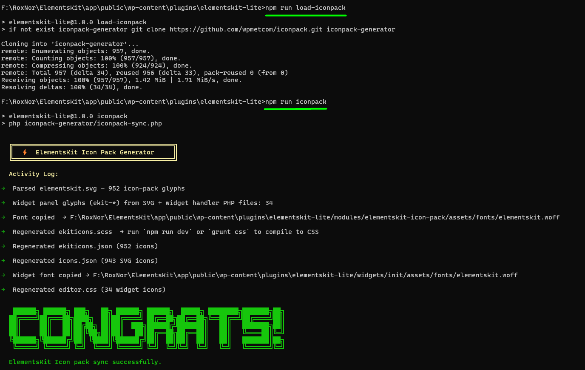

# ElementsKit Iconpack Generator
A dev tool for generating ElementsKit icon pack files from IcoMoon source. Not required for the plugin to run — only needed when adding or removing icons.

---

## Workflow

### 1. Place the two IcoMoon zip files into the `Icomoon/` folder
- `elementskit-v*.zip` — contains `fonts/` (woff, svg)
- `icomoon*.zip` — contains `SVG/` folder

The script will extract them automatically.

### 2. Push changes to this repository so the latest icons are saved.

```bash
git add .
git commit -m "added elementor icon"
git push
```

### 4. Load the repository into the plugin
From the **ElementsKit Lite plugin root**, run:

```bash
npm run load-iconpack
```

### 5. Generate the icon pack
```bash
npm run iconpack
```


